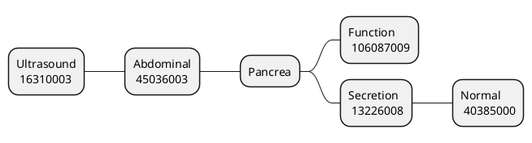

### PlantUML example

```plantuml
@startmindmap
* Ultrasound\n 16310003
** Abdominal\n 45036003
*** Pancrea
**** Function\n 106087009
**** Secretion\n 13226008
***** Normal\n 40385000

@endmindmap
```
